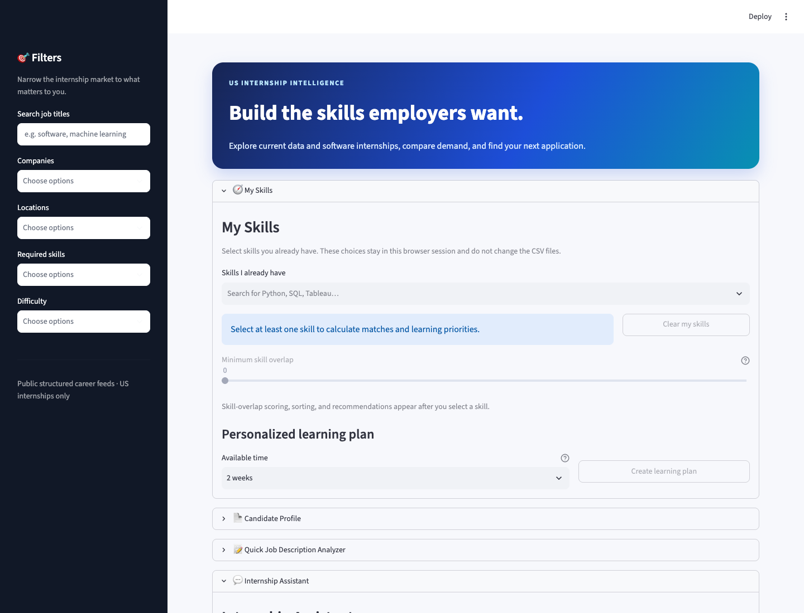
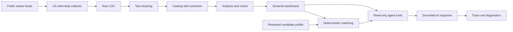

# Internship Skill Analyzer

[](https://github.com/adarshcm28/Internship-Skill-Analyzer/actions/workflows/tests.yml)

An end-to-end Python application that collects US internship postings, extracts
employer-requested skills, compares them with a candidate profile, and provides
grounded AI career guidance with privacy and reliability controls.

## Portfolio snapshot

- **Data:** 23 US internships from 13 companies and 17 locations in the committed snapshot
- **Pipeline:** five structured career-system connectors, cleaning, skill extraction, analysis, and charts
- **Product:** interactive Streamlit dashboard, job explorer, learning plans, and resume matching
- **AI:** grounded OpenAI Responses API assistant with four deterministic read-only tools
- **Quality:** offline unit tests, Streamlit smoke tests, evaluation cases, and documented limitations
- **Status:** roadmap complete — 19 of 19 daily milestones



## What the application does

### Explore the internship market

- Filter current US postings by title, company, location, skill, and difficulty.
- View skill frequency, skill categories, combinations, and posting difficulty.
- Inspect descriptions and follow links to original company application pages.
- Paste a job description for local, transparent catalog-skill extraction.

### Personalize the analysis

- Select known skills and calculate deterministic overlap for every visible job.
- See matched skills, missing skills, strongest opportunities, and learning priorities.
- Generate a structured 2-, 4-, 8-, or 12-week learning plan.
- Upload and review a PDF, DOCX, or TXT resume in the private Candidate Profile.

### Use a grounded internship assistant

The Internship Assistant can search jobs, compare two or three postings, calculate
skill gaps, and summarize market trends. Project code performs the calculations;
the model explains verified results and cites supplied company sources.

The tool loop is read-only and bounded to four calls over three rounds. A visible
trace explains which tools supported an answer, while developer diagnostics show
latency, citations, and token counts without logging private content.

## Architecture



Detailed design, lineage, tradeoffs, and diagrams are in the
[architecture guide](docs/project-architecture.md).

## Technology

| Area | Tools |
| --- | --- |
| Language and analysis | Python, pandas, NumPy |
| Collection | Requests, Ashby, Lever, Greenhouse, Amazon Jobs, Workday |
| NLP | Auditable keyword and alias catalog |
| Visualization | Plotly, Matplotlib |
| Interface | Streamlit |
| AI | OpenAI Responses API and strict function tools |
| Documents | pypdf, python-docx |
| Testing | unittest, mocks, Streamlit AppTest |

## Quick start

Requirements: Python 3.11 or newer.

```bash
git clone https://github.com/adarshcm28/Internship-Skill-Analyzer.git
cd Internship-Skill-Analyzer
python -m venv .venv
source .venv/bin/activate
pip install -r requirements.txt
streamlit run app.py
```

Open [http://localhost:8501](http://localhost:8501).

The dashboard, local extraction, charts, matching, and job-description analyzer
work without an API key. To enable AI features, copy `.env.example` to `.env` and
add a key from your own OpenAI API project:

```dotenv
OPENAI_API_KEY=your_api_key_here
OPENAI_MODEL=gpt-5.6-luna
```

`.env` is ignored by Git. Never commit or display the actual key.

## Candidate privacy

Resume extraction happens locally. The original file is not written to the
repository or a database. Users review and edit the extracted profile before it
is used. Deterministic resume matching does not call OpenAI.

For resume suggestions or a cover-letter draft, the app requires explicit consent
and sends only the reviewed fields, selected posting evidence, and calculated
match. API calls use `store=False`. **Delete uploaded data** clears the uploader,
extracted content, profile, consent, target, and generated guidance from the session.

See [production readiness](docs/production-readiness.md) for the full privacy,
safety, reliability, and deployment checklist.

## Reproduce the data pipeline

Test current public endpoints without replacing saved data:

```bash
python -m src.collect_postings --dry-run
```

Rebuild the US artifacts:

```bash
python -m src.collect_postings
python -m src.clean_text --input data/raw/us_internship_postings.csv --output data/processed/us/cleaned_postings.csv
python -m src.extract_skills --input data/processed/us/cleaned_postings.csv --postings-output data/processed/us/postings_with_skills.csv --skills-output data/processed/us/posting_skills.csv
python -m src.analyze_skills --postings data/processed/us/postings_with_skills.csv --skills data/processed/us/posting_skills.csv --output-dir data/processed/us/analysis
python -m src.create_visualizations --analysis-dir data/processed/us/analysis --output-dir reports/figures/us
```

Collection behavior and US-location rules are documented in the
[data collection guide](docs/data-collection.md).

## Testing and evaluation

```bash
python -m unittest discover -s tests -v
```

Tests mock OpenAI calls and cover collection filters, extraction, retrieval,
matching, tools, orchestration, uploads, deletion, and evaluation scoring. No paid
API request is made by the normal test suite.

The [evaluation cases](evals/cases.json) cover search, comparison, personalization,
market insights, empty evidence, prompt injection, and unsupported submission.
See the [baseline and human rubric](evals/baseline.md).

## Repository map

```text
├── app.py                       Streamlit application
├── config/job_boards.json       Company board configuration
├── data/raw/                    Saved collection snapshots
├── data/processed/us/           Cleaned and analyzed US data
├── evals/                       Evaluation cases and baseline
├── reports/figures/us/          Generated portfolio charts
├── src/                         Pipeline, matching, agent, and evaluation code
├── tests/                       Offline regression suite
└── docs/                        Architecture, controls, roadmap, and demo
```

## Current findings

| Skill | Postings | Share |
| --- | ---: | ---: |
| Python | 22 | 95.7% |
| Communication | 17 | 73.9% |
| Problem Solving | 14 | 60.9% |
| Collaboration | 11 | 47.8% |
| Statistics | 9 | 39.1% |

These figures describe the committed 23-posting educational sample, not the
entire US internship market.

## Limitations

- The dataset is a small, dated sample and may contain closed postings.
- Provider coverage depends on public structured career endpoints.
- Keyword extraction can miss synonyms and context outside the catalog.
- “Beginner-friendly” is an explainable skill-count heuristic.
- Skill overlap does not predict eligibility, interviews, or hiring.
- Image-only and password-protected resume PDFs are not supported.
- AI guidance requires user review and never submits applications.

## Interview resources

- [Seven-minute interview demo](docs/interview-demo.md)
- [System architecture](docs/project-architecture.md)
- [Responsible AI and production readiness](docs/production-readiness.md)
- [Complete 19-day roadmap](docs/roadmap/README.md)
- [Skill-gap specification](docs/skill-gap-analyzer.md)

## Portfolio summary

This project demonstrates data engineering, NLP, analytics, UI design, AI tool
orchestration, testing, privacy engineering, and technical communication in one
explainable application. It deliberately separates deterministic facts from
generative guidance and documents what the system cannot guarantee.
