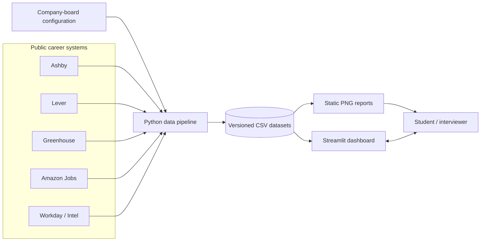
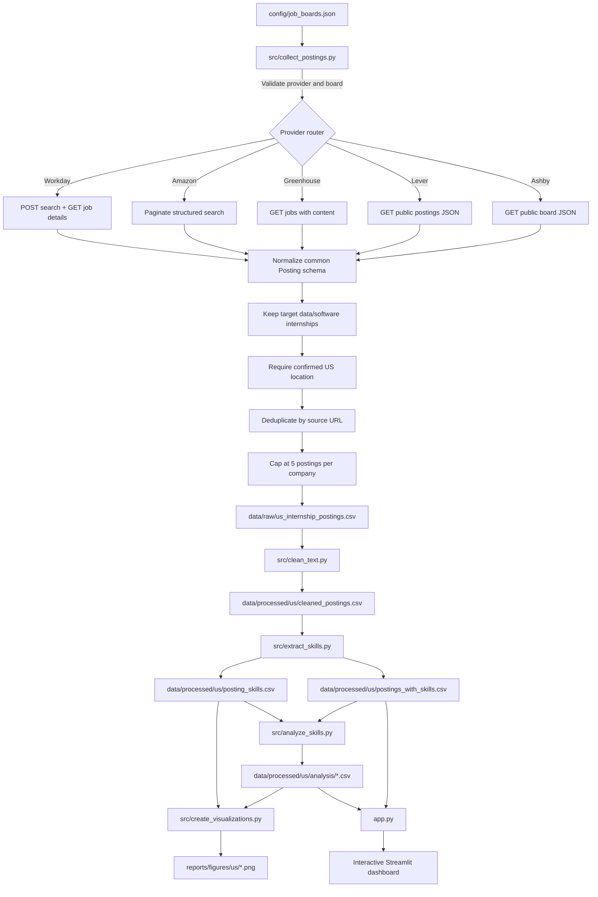
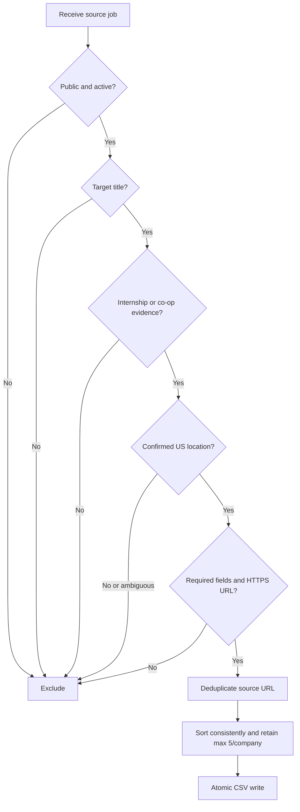
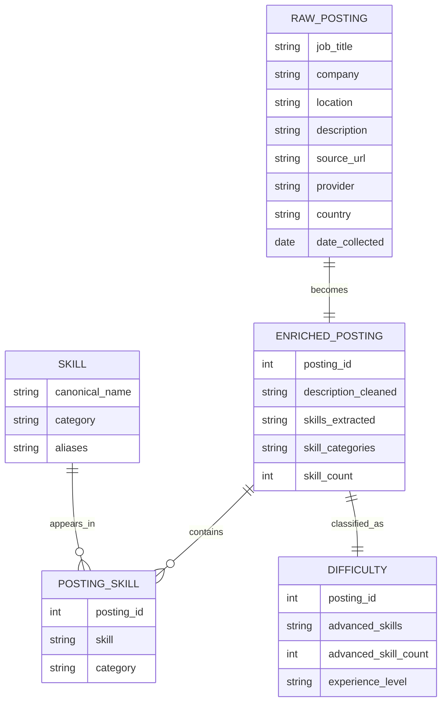
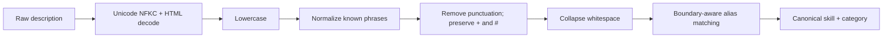
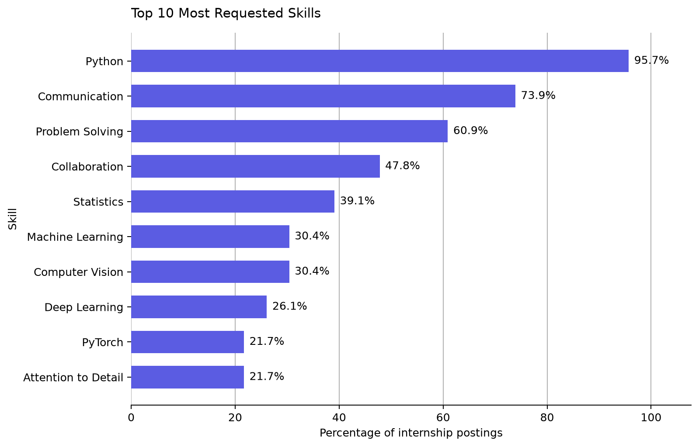
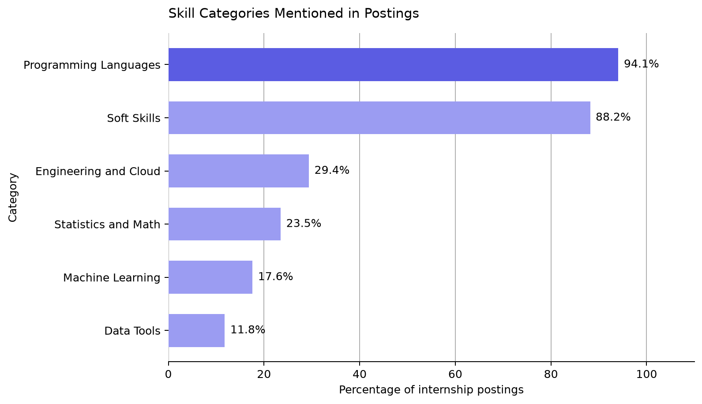
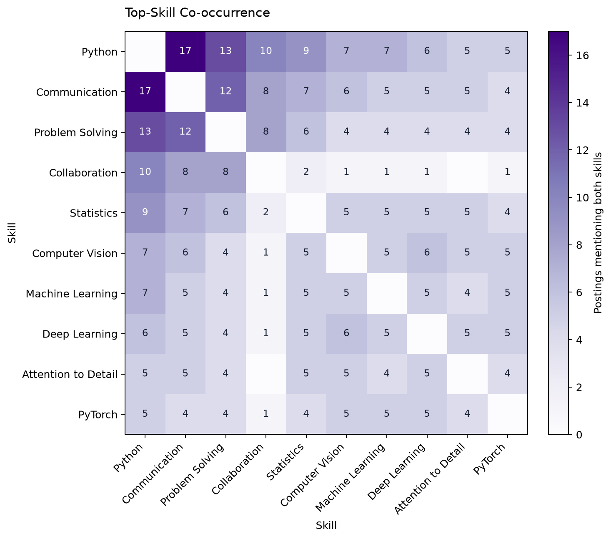
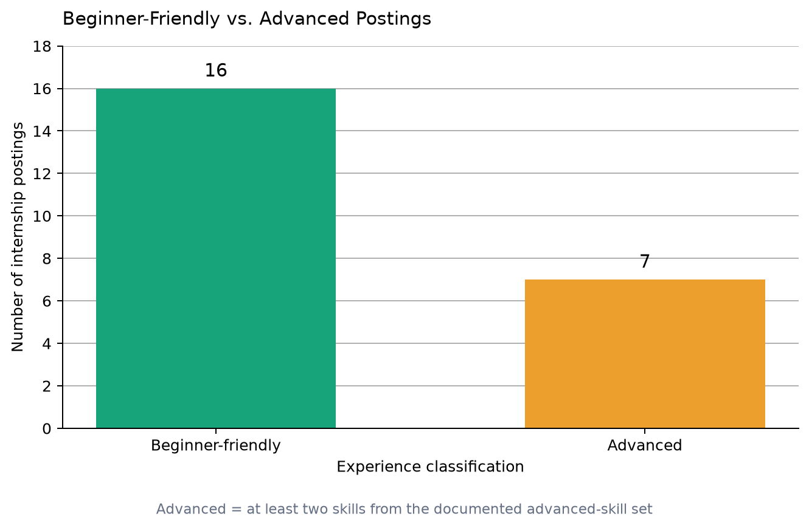
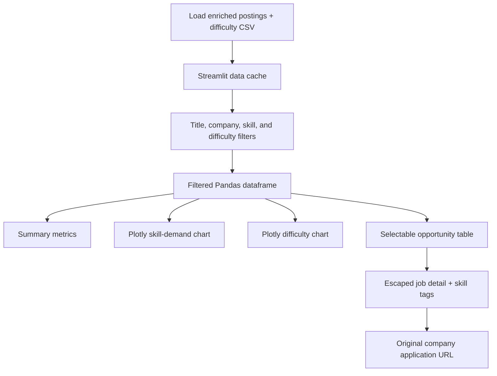

# Internship Skill Analyzer — System Architecture

> Interview guide and technical reference for the end-to-end internship-data pipeline.

## Executive summary

The Internship Skill Analyzer is a reproducible Python data product that collects
public US internship listings, normalizes job descriptions, extracts a documented
skill taxonomy, calculates market trends, and serves the results in an interactive
Streamlit dashboard.

The project is intentionally API-first. It reads structured career feeds rather
than scraping arbitrary pages, records the original application URL for
traceability, and applies the same filtering rules to every provider.

### Current project snapshot

| Measure | Current value |
| --- | ---: |
| Configured company boards | 32 |
| Supported career-feed connectors | 5 |
| Retained US internships | 23 |
| Companies represented | 13 |
| Unique skills detected | 23 |
| Posting-to-skill matches | 118 |
| Beginner-friendly classifications | 16 |
| Advanced classifications | 7 |
| Maximum retained per company | 5 |

These values describe the committed August 29, 2026 dataset. Live career listings
change, so rerunning the collector may produce different results.

## 1. System context



The external career systems own the source listings. This repository owns the
collection rules, normalized schema, analysis logic, generated artifacts, and UI.

## 2. End-to-end data flow



### Pipeline contract

Each stage reads a file produced by the previous stage and writes a new artifact.
Raw source data is never silently replaced when collection returns fewer than the
configured minimum number of valid postings.

## 3. Collector architecture

### Provider routing

| Provider | Search approach | Description source | Location evidence |
| --- | --- | --- | --- |
| Ashby | Public job-board GET endpoint | `descriptionPlain` | Structured postal country plus secondary locations |
| Lever | Public postings GET endpoint | Plain description plus list sections | Country field and individually checked additional locations |
| Greenhouse | Public jobs GET endpoint with `content=true` | HTML content converted to text | Posting location and attached office locations |
| Amazon Jobs | Paginated structured search response | Description and qualification fields | ISO country code must be `USA` |
| Workday | Paginated search POST, followed by detail GET | Full detail description | Detail country metadata and location |

### Collector decision logic



Target titles include data, analytics, machine learning, AI, research science,
software, computer science, developer, frontend, backend, and full-stack roles.
Internship evidence must appear in the title or employment type; merely mentioning
interns in an experienced role's description is not sufficient.

### Reliability and data-quality controls

- Finite 30-second HTTP timeouts prevent a stalled board from blocking forever.
- One failing company board produces a warning while other boards continue.
- Provider-specific payloads are converted into one `Posting` dataclass.
- Ambiguous locations such as `Remote`, `Worldwide`, or a bare city are rejected.
- URLs must use HTTPS, and duplicate source URLs are removed.
- The output is first written to a temporary file and then atomically moved.
- A configurable minimum posting count protects the previous dataset from a bad run.
- The five-per-company cap reduces domination by a single large employer.

## 4. Data model and lineage



### Why both wide and normalized skill tables?

- `postings_with_skills.csv` keeps one row per posting and is convenient for the UI.
- `posting_skills.csv` keeps one row per posting-skill relationship and is convenient
  for grouping, ranking, category analysis, and co-occurrence calculations.

## 5. Text processing and skill extraction



The extractor is deterministic and explainable. A catalog maps text aliases to a
canonical name; for example, `jupyter notebook` maps to `Jupyter`. Boundary-aware
regular expressions prevent partial-word matches. The current taxonomy covers:

- Programming languages
- Data tools
- Machine learning
- Statistics and mathematics
- Engineering and cloud
- Soft skills

This approach favors auditability over the flexibility of a black-box model. Its
main limitation is recall: a skill not included in the catalog cannot be detected.

## 6. Analysis logic

| Output | Calculation | Purpose |
| --- | --- | --- |
| `skill_summary.csv` | Unique postings per skill and percentage of all postings | Rank market demand |
| `category_summary.csv` | Posting reach, mentions, and unique skills per category | Compare skill families |
| `skill_combinations.csv` | Unordered skill pairs appearing in the same posting | Find complementary skills |
| `posting_difficulty.csv` | Count documented advanced skills per posting | Explain beginner/advanced split |
| `analysis_summary.csv` | Dataset-level totals | Populate summary metrics |

A posting is classified as **Advanced** when it contains at least two skills from
the documented advanced-skill set; otherwise it is **Beginner-friendly**. This is
an explainable project heuristic, not a judgment of whether a person is qualified.

## 7. Current analysis results

### Top requested skills



### Skill-category reach



### Skills that appear together



### Difficulty classification



These charts are generated from analysis CSVs rather than manually edited. That
makes every figure reproducible from the underlying posting data.

## 8. User-interface architecture



The interface performs read-only exploration. It does not edit the datasets or
submit job applications. Externally sourced title and location values are escaped
before being inserted into custom HTML.

Run the app with:

```bash
.venv/bin/python -m streamlit run app.py
```

Then open `http://localhost:8501`.

## 9. Repository map

```text
Internship-Skill-Analyzer/
├── app.py                         # Interactive Streamlit dashboard
├── config/
│   └── job_boards.json            # Company, provider, and board identifiers
├── src/
│   ├── collect_postings.py        # Five provider connectors + validation
│   ├── clean_text.py              # Deterministic text normalization
│   ├── extract_skills.py          # Taxonomy and alias-based extraction
│   ├── analyze_skills.py          # Aggregations and difficulty heuristic
│   └── create_visualizations.py   # Reproducible static charts
├── data/
│   ├── raw/                       # Source-shaped snapshots
│   └── processed/us/              # Cleaned, enriched, and analyzed data
├── reports/figures/us/            # Generated charts
├── tests/test_us_locations.py     # Collector regression tests
└── docs/
    ├── data-collection.md         # Detailed collector rules
    └── project-architecture.md    # This interview guide
```

## 10. Testing strategy

The offline regression suite verifies:

- Explicit and ambiguous US locations
- Provider-specific multi-location handling
- Data/software internship title matching
- Rejection of sales and experienced roles
- Greenhouse, Amazon Jobs, and Workday payload conversion
- URL deduplication
- Five-postings-per-company enforcement

Run it with:

```bash
.venv/bin/python -m unittest discover -s tests -v
```

Live endpoint behavior is tested separately with a dry run so network changes do
not make the offline unit tests unreliable:

```bash
.venv/bin/python -m src.collect_postings --dry-run
```

## 11. Design decisions and tradeoffs

| Decision | Benefit | Tradeoff |
| --- | --- | --- |
| API/structured-feed first | More stable and structured than page scraping | Limited to supported providers and configured boards |
| Conservative US filter | Reduces accidental inclusion of international jobs | May omit ambiguous US postings |
| Maximum five per company | Reduces single-company dominance | Does not create a statistically representative sample |
| Keyword skill taxonomy | Fast, deterministic, and auditable | Misses synonyms or skills outside the catalog |
| Explainable difficulty rule | Easy to inspect and discuss | Not a validated measure of actual job difficulty |
| CSV artifacts in Git | Transparent, portable, and easy to review | Less scalable than a database for much larger datasets |
| Streamlit UI | Rapid Python-native delivery | Less frontend control than a separate web client/API |

## 12. Known limitations and next steps

1. Add connectors for more large-company career systems where collection is
   technically and contractually appropriate.
2. Add publication/expiration tracking so closed jobs can be identified across runs.
3. Expand and test the software-engineering skill taxonomy.
4. Add end-to-end pipeline automation and scheduled refreshes.
5. Add data-quality monitoring for provider schema changes.
6. Add a grounded chatbot that answers only from the analyzed dataset.
7. Move to a database if data volume or refresh frequency outgrows versioned CSVs.

## 13. Interview walkthrough

A concise way to present the project:

1. **Problem:** Internship requirements are scattered across company career sites.
2. **Collection:** Five provider connectors normalize listings into one schema.
3. **Quality:** US-only evidence, role rules, deduplication, minimum-size protection,
   and employer caps make collection consistent and reviewable.
4. **Transformation:** A deterministic NLP pipeline cleans descriptions and maps
   aliases into a documented skill taxonomy.
5. **Analysis:** Pandas calculates demand, category reach, co-occurrence, and an
   explainable difficulty heuristic.
6. **Delivery:** Static reports support reproducible findings, while Streamlit lets
   users filter opportunities and open the original application pages.
7. **Engineering judgment:** The design favors traceability and explainability, and
   explicitly documents where broader coverage or statistical validity is limited.

## 14. Reproduce the US pipeline

```bash
.venv/bin/python -m src.collect_postings
.venv/bin/python -m src.clean_text \
  --input data/raw/us_internship_postings.csv \
  --output data/processed/us/cleaned_postings.csv
.venv/bin/python -m src.extract_skills \
  --input data/processed/us/cleaned_postings.csv \
  --postings-output data/processed/us/postings_with_skills.csv \
  --skills-output data/processed/us/posting_skills.csv
.venv/bin/python -m src.analyze_skills \
  --postings data/processed/us/postings_with_skills.csv \
  --skills data/processed/us/posting_skills.csv \
  --output-dir data/processed/us/analysis
.venv/bin/python -m src.create_visualizations \
  --analysis-dir data/processed/us/analysis \
  --output-dir reports/figures/us
```

The collection step uses live public endpoints. The remaining stages are fully
reproducible from the saved raw CSV.
